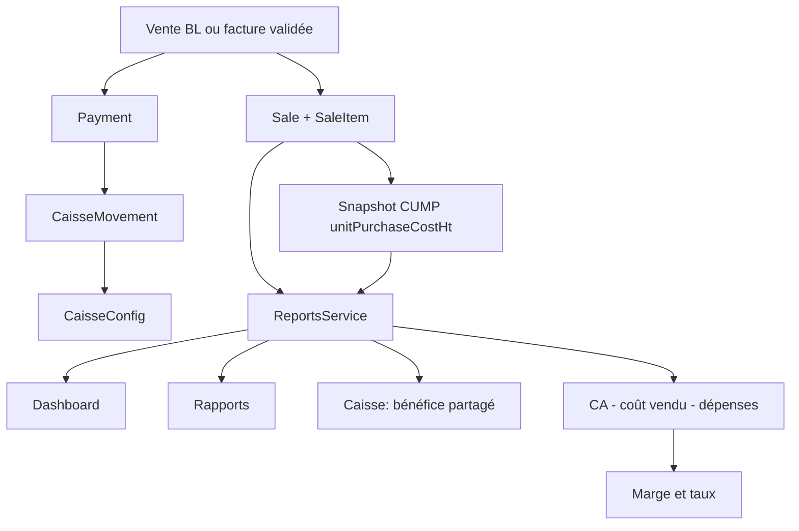
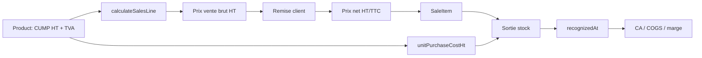
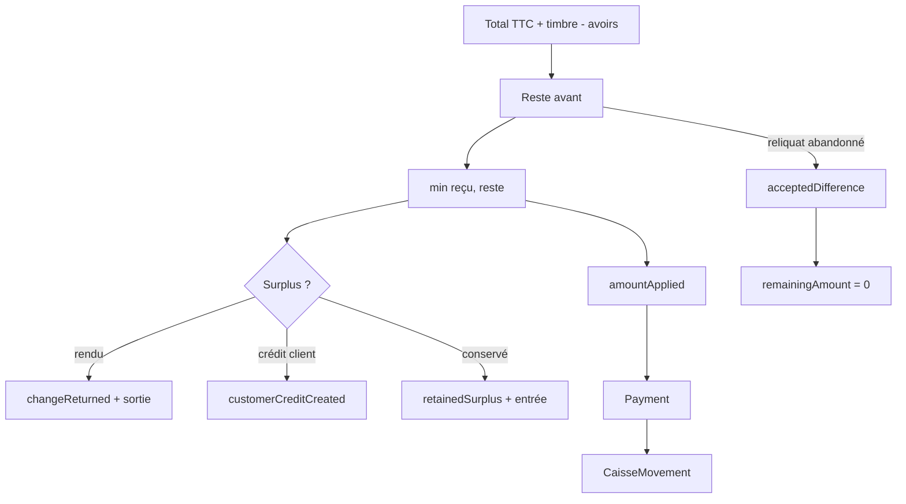
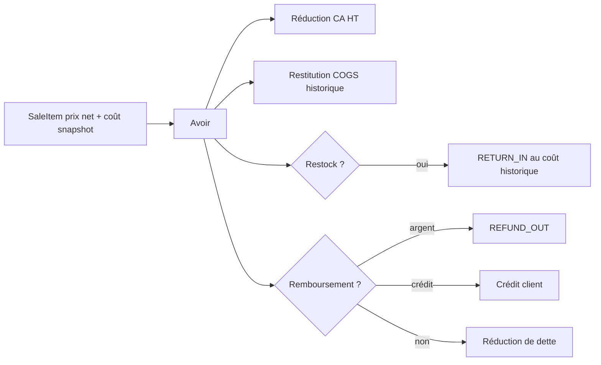
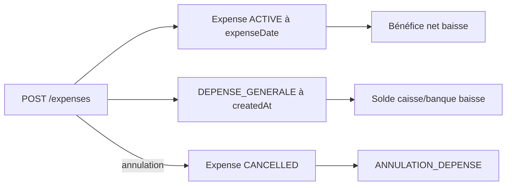
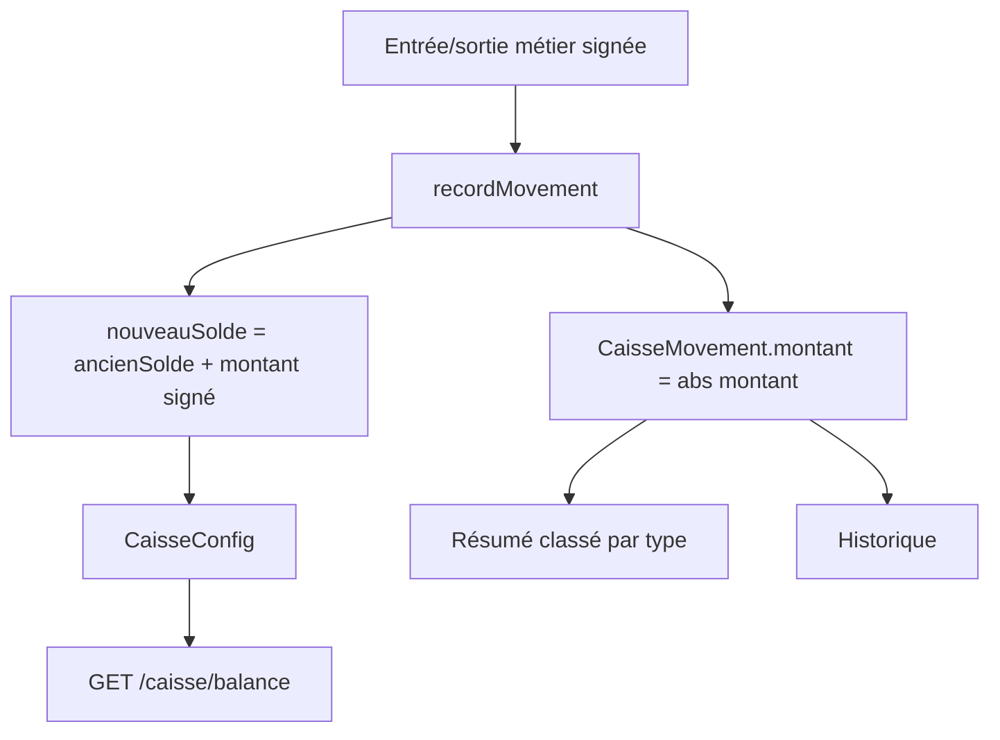

# Audit complet du moteur financier Stockini

> Audit statique du code au 30 juillet 2026. Aucun code métier n'a été modifié. Les numéros de ligne cités correspondent à l'état du dépôt au moment de l'audit.

## 1. Résumé exécutif

Le moteur financier a une base saine : montants PostgreSQL en `DECIMAL`, calculateurs principaux en `decimal.js`/`Prisma.Decimal`, arrondi TND à trois décimales en `ROUND_HALF_UP`, séparation du chiffre d'affaires HT, de la TVA, du timbre, des paiements et de la trésorerie, coût historique figé sur `SaleItem`, CUMP net fournisseur, et même source de marge pour Rapports et Caisse.

L'audit met néanmoins en évidence des incohérences certaines :

1. **Flux de caisse faux dans Rapports** : `CaisseMovement.montant` est toujours persisté en valeur absolue, mais `summarizeCashMovements()` déduit entrées et sorties du signe. En production, toutes les lignes deviennent donc des entrées dans `GET /reports/overview`; les sorties et le flux net y sont faux. `GET /caisse/summary`, qui classe par type, reste correct.
2. **Tests non représentatifs de la persistance** : le test de Rapports injecte des sorties négatives alors que `recordMovement()` les enregistre positives. Il ne peut pas détecter l'anomalie précédente.
3. **Dette client divergente après écart accepté** : Rapports utilise `Sale.remainingAmount`, mis à zéro par `acceptedDifference`; Caisse appelle `CustomersService.getTotalClientDebt()`, qui recalcule `total + timbre - paidAmount - totalRefunded` sans additionner les écarts acceptés. Le même reliquat apparaît donc soldé dans Rapports et encore dû dans Caisse.
4. **Filtres avancés partiels** : vendeur/client/produit/catégorie filtrent ventes, marge et encaissements, mais pas dépenses, avoirs affichés, achats, stock ni mouvements de caisse. Un rapport filtré mélange ainsi périmètre filtré et charges/flux globaux.
5. **Top clients non comparable au CA principal** : le KPI principal est HT hors timbre; le classement clients additionne `Sale.total + stampDuty - totalRefunded`, donc du TTC timbre inclus.
6. **Top produits brut de retours** : `topProduits` additionne les lignes vendues sans déduire les avoirs; `topProduitsBenefice` déduit les retours. Les deux classements peuvent donner des quantités et revenus différents.
7. **Avoirs affichés non filtrés** : les cartes d'avoirs de Rapports ignorent les filtres avancés, alors que l'impact des avoirs dans CA/marge les applique.
8. **Chronologie achats fragile** : les KPI achats utilisent `Purchase.createdAt`. Une commande ancienne transformée ou réceptionnée aujourd'hui devient payable mais reste imputée à sa date de commande, sans date de reconnaissance achat/réception dédiée.
9. **Arrondis frontend/backend achats différents** : le backend arrondit la remise fournisseur unitaire avant multiplication; le frontend arrondit la remise de ligne. Une différence de 0,001 DT est possible.
10. **Avoir frontend/backend potentiellement différent** : le backend arrondit HT et TTC ligne par ligne; le frontend somme les valeurs non arrondies puis arrondit le total.
11. **Valeur de stock calculée en `number`** : `quantity × purchasePrice/salePrice` est accumulé en flottants JS dans deux chemins de Rapports, contrairement aux KPI de marge.
12. **Bénéfice par compte trompeur dans Caisse** : les vues « caisse physique » et « banque » affichent chacune le bénéfice commercial global identique; il n'est pas ventilé par compte.

## 2. Périmètre et méthode

Ont été inspectés : schéma Prisma, migrations financières, contrôleurs, DTO, services ventes/achats/stock/paiements/avoirs/dépenses/caisse/rapports/clients/produits, utilitaires de calcul, requêtes SQL brutes, tests, appels API frontend, composants Dashboard/Rapports/Caisse, calculateurs frontend et export CSV.

Les fichiers pivots sont :

- `backend/prisma/schema.prisma`;
- `backend/src/reports/reports.service.ts` et `reports-financial.utils.ts`;
- `backend/src/caisse/caisse.service.ts`;
- `backend/src/sales/sales.service.ts`;
- `backend/src/purchases/purchases.service.ts`;
- `backend/src/stock/stock.service.ts`;
- `backend/src/payments/payments.service.ts`;
- `backend/src/avoirs/avoirs.service.ts`;
- `backend/src/expenses/expenses.service.ts`;
- `backend/src/common/utils/{sales-calculations,purchase-calculations,customer-payment,payment-status,commercial-document}.ts`;
- `frontend/src/components/stockini/{SimpleDashboard,AnalyticsDashboard}.tsx`;
- `frontend/src/components/stockini/caisse/*`;
- `frontend/src/lib/{salesCalculations,purchaseCalculations,kpi-definitions}.ts`.

Il n'existe pas de `DashboardService` distinct : Dashboard et Rapports passent tous deux par `ReportsService`. Les agrégats sont principalement exprimés via Prisma (`aggregate`, `groupBy`, `findMany`) plutôt que par SQL écrit à la main.

## 3. Modèle de données financier

| Table/modèle | Colonnes financières déterminantes | Rôle |
|---|---|---|
| `Product` | `purchasePrice`, `purchasePriceTtc`, `salePrice`, `quantity`, `tva` | `purchasePrice` est le CUMP HT net courant; valorisation du stock et source du prochain snapshot |
| `Purchase` | `subtotal`, `discount`, `tax`, `total`, `stampDuty`, `paidAmount`, `remainingAmount`, `paymentStatus`, `documentType`, `createdAt` | Document fournisseur et dette mise en cache |
| `PurchaseItem` | `unitCost`, `discountPercent`, `discountAmount`, `unitCostHtNet`, `lineTotalHtNet`, `receivedQuantity` | Prix brut, remise fournisseur et coût net reçu |
| `StockMovement` | quantités avant/après, `unitCostHtGross`, `purchaseDiscountPercent`, `unitCostHtNet`, `totalCostHtNet`, sources | Journal quantitatif et valorisé des réceptions/sorties/retours |
| `Sale` | `subtotal`, `discount`, `tax`, `total`, `stampDuty`, `recognizedAt`, `paidAmount`, `remainingAmount`, `totalRefunded`, statuts | Document commercial, reconnaissance du CA et dette mise en cache |
| `SaleItem` | `unitPrice`, `discountPercent`, `finalUnitPrice`, `total`, `unitPurchaseCostHt`, `purchaseCostEstimated` | Prix brut/net et snapshot historique du CUMP |
| `Payment` | `amount`, `amountReceived`, `amountApplied`, `changeReturned`, `retainedSurplus`, `customerCreditCreated`, `acceptedDifference`, `cashImpactDone` | Allocation des règlements et traçabilité des écarts |
| `CreditNote` | `subtotal`, `tax`, `total`, `stampDuty`, `montantRembourse`, `debtReductionAmount`, `customerCreditAmount`, `dateAvoir` | Avoir, réduction de dette et remboursement |
| `CreditNoteItem` | quantité, prix HT, TVA, totaux, `stockRestocked`, lien `saleItem` | Annulation du revenu et restitution du coût historique |
| `Expense` | `amount`, `expenseDate`, `paymentSource`, `status` | Charge économique et sortie de trésorerie |
| `CaisseMovement` | `type`, `treasuryAccount`, `montant`, `ancienSolde`, `nouveauSolde`, sources, `clearedAt` | Grand livre opérationnel des mouvements de trésorerie |
| `CaisseConfig` | `solde`, `soldeBanque` | Soldes courants matérialisés |
| `CashTransaction` | `amount`, `direction`, `sourceType` | Modèle présent mais non consommé par les KPI audités |

Références : schéma `Product` lignes 230-286, `StockMovement` 353-382, `Sale` 384-452, `SaleItem` 474-499, `Purchase` 525-560, `PurchaseItem` 562-581, `Payment` 583-634, `Expense` 636-668, `CreditNote` 830-890 et caisse 892-965.

### Vocabulaire de coût réellement présent

| Terme demandé | Présence réelle | Signification/usage |
|---|---|---|
| `purchasePrice` | Oui | `Product.purchasePrice`, CUMP HT net courant; valorisation stock et snapshot vente |
| `purchasePriceTtc` | Oui | Dérivé du CUMP HT et TVA; sert à la tarification automatique |
| `historicalCost` | Contrat API seulement | Alias Caisse de `SaleItem.unitPurchaseCostHt × quantité nette` |
| `unitPurchaseCostHt` | Oui | Snapshot historique immuable du CUMP à la sortie |
| `averageCost` | Variable locale | Résultat de `calculateWeightedAverageCost()` dans `StockService.applyMovement()` |
| `weightedCost` | Non | Aucun champ/modèle de ce nom |
| `snapshotCost` | Non | Concept porté par `unitPurchaseCostHt`, pas par ce nom |
| `purchaseNet`/`purchaseGross` | Non comme champs | Concepts portés par `unitCostHtNet` et `unitCost` |
| `costPrice` | Non | Aucun champ métier de ce nom |
| `CUMP` | Oui, sans champ nommé CUMP | `Product.purchasePrice` |
| `FIFO` | Non pour le coût | Aucun lot ni allocation FIFO; seul le retour consolidé répartit des quantités entre lignes sources dans leur ordre |

## 4. Cartographie générale



La vente produit le résultat commercial à `recognizedAt`, même impayée. Le paiement produit la trésorerie à `Payment.createdAt`. Ces deux dates et ces deux notions ne doivent pas être confondues.

## 5. Flux Vente



`calculateSalesLine()` (`backend/src/common/utils/sales-calculations.ts:73-143`) calcule :

```text
PV TTC brut = round3(PA TTC net × (1 + marge catalogue/100))
remise unitaire TTC = round3(PV TTC brut × remise/100)
PV TTC net = round3(PV TTC brut - remise TTC)
PV HT net = round3(PV TTC net / (1 + TVA/100))
HT ligne = round3(PV HT net × quantité)
TVA ligne = TTC ligne - HT ligne
marge unitaire = PV HT net - CUMP HT net
taux de marge = marge / coût × 100
taux de marque = marge / vente nette × 100
```

Le frontend dupliqué (`frontend/src/lib/salesCalculations.ts`) est pratiquement identique. Le backend reste autoritaire et recalcule les lignes dans `SalesService.create()` lignes 651-770.

Cas 100,000 DT HT, TVA 19 %, marge catalogue 40 %, remise 15 %, quantité 2 : achat TTC 119,000; vente TTC brute 166,600; remise 24,990; vente TTC nette 141,610; vente HT nette 119,000 par unité; HT ligne 238,000; coût 200,000; marge 38,000; taux de marge 19,000 %; taux de marque 15,966 %.

Documents avec impact : seuls `BON_LIVRAISON` et `FACTURE` sont dans `STOCK_IMPACTING_TYPES`; le snapshot est pris lors de création, validation ou transformation qui applique effectivement le stock (`sales.service.ts:649`, 803-878, 1051-1120, 1746-1868).

## 6. Flux Achat et CUMP


Formules backend (`purchase-calculations.ts:32-58`, `stock.service.ts:292-369`) :

```text
remise unitaire = round3(PU brut × remise % / 100)
PU net = round3(PU brut - remise unitaire)
net ligne = round3(PU net × quantité)
TVA = round3(net ligne × TVA % / 100)
CUMP = round3((stock avant × ancien CUMP + quantité reçue × PU net) / stock après)
```

Exemple : stock 10 à 50,000, réception 5 à 60,000 net : CUMP = `(500 + 300) / 15 = 53,333 DT`.

La réception `PATCH /purchases/:id/receive` augmente `receivedQuantity`, crée `PURCHASE_RECEPTION`, et active le BC en BR payable (`purchases.service.ts:330-430`). Elle ne touche pas la caisse; le paiement fournisseur passe par `/payments/purchases/:id/pay`.

Anomalie d'arrondi frontend : avec PU 1,005, quantité 3 et remise 10 %, backend : remise unitaire 0,101, PU net 0,904, ligne 2,712. Frontend : brut ligne 3,015, remise ligne 0,302, net 2,713. L'écran peut donc annoncer 0,001 DT de plus que le document persisté.

## 7. Flux Paiement



Source : `allocateCustomerPayment()` (`customer-payment.ts:29-121`) et `PaymentsService.paySale()` lignes 341-684.

- paiement partiel : `amountApplied < remainingBefore`, statut `PARTIAL`;
- paiement total : reste à zéro, statut `PAID`;
- surpaiement : destination obligatoire;
- rendu monnaie : entrée brute reçue puis `CUSTOMER_CHANGE_OUT`;
- surplus conservé : entrée du montant appliqué puis `CASH_SURPLUS_IN`;
- crédit client : entrée du montant reçu et incrément de `Customer.creditBalance`;
- écart accepté : `acceptedDifference = reste - appliqué`, reste mis à zéro avec permission dédiée.

Exemple dette 329,000, reçu 330,000 :

| Choix | `Payment.amount` | Mouvement entrée | Autre mouvement | Flux net |
|---|---:|---:|---:|---:|
| 1 DT rendu | 329 | 330 | sortie 1 | 329 |
| 1 DT conservé | 329 | 329 | entrée surplus 1 | 330 |
| 1 DT en crédit client | 329 | 330 | crédit client 1 | 330 |

Le bénéfice produit ne change dans aucun cas. En revanche, l'écart accepté n'est ni retranché du CA ni enregistré comme charge/perte : il solde seulement le cache de créance. C'est une lacune comptable si l'indicateur « bénéfice net » doit intégrer les abandons de créance.

## 8. Flux Avoir, retour et remboursement



Le backend reprend `finalUnitPrice` ou `SaleItem.total / quantity`, arrondit HT et TTC par ligne, et reprend `unitPurchaseCostHt` pour le stock et le COGS (`avoirs.service.ts:303-385`, 494-508). Le remboursement ne peut excéder le paiement effectif disponible (`390-439`). Le timbre n'est remboursable que pour un retour total.

Le calcul commercial central déduit `CreditNote.subtotal` du CA et le coût historique des quantités retournées du COGS (`reports.service.ts:507-565`). Un avoir sans restock réduit quand même CA et COGS : `getSalesProfitForPeriod()` ne filtre pas `stockRestocked`. C'est cohérent pour une annulation commerciale de la vente, mais distinct de la quantité physique.

## 9. Flux Dépense



Une dépense a deux dates : `expenseDate` pour le bénéfice, `CaisseMovement.createdAt` pour la trésorerie. Elle baisse immédiatement le compte choisi et le bénéfice net de la période économique. Une annulation remet la trésorerie et exclut la dépense du bénéfice (`expenses.service.ts:103-164`, 201-270).

Une dépense liée à un achat ne diminue pas le montant de l'achat ni son COGS; elle reste une charge séparée. C'est correct, à condition d'éviter de saisir comme « dépense » un coût déjà inclus dans le prix d'achat si la politique comptable ne veut pas le doubler.

## 10. Flux Caisse et reconstruction du solde



`recordMovement()` route `CASH` vers `PHYSICAL_CASH` et carte/virement/chèque vers `BANK_TREASURY`; `CREDIT` est rejeté. Il vérifie le solde négatif, met à jour `CaisseConfig`, puis écrit ancien/nouveau solde et montant absolu (`caisse.service.ts:784-885`).

Le solde courant **n'est pas reconstruit à la lecture** depuis le journal : `GET /caisse/balance` lit directement `CaisseConfig` (`154-163`). Le journal permet une reconstruction théorique par ordre chronologique et couples `ancienSolde/nouveauSolde`, mais aucun endpoint d'intégrité ne la réalise.

La remise à zéro crée un mouvement `CASH_RESET` contenant l'ancien solde et met le compte à zéro (`613-683`). Le vidage d'historique ne supprime ni ne contre-passe : il renseigne `clearedAt`; le solde et les agrégats de synthèse ne changent pas (`688-733`). Les listes `/transactions` et `/historique` masquent les lignes effacées, tandis que `/summary`, `/analytics` et Rapports ne filtrent pas `clearedAt` : cette asymétrie est cohérente si « vider » signifie masquer l'historique sans altérer la comptabilité, mais elle n'est pas explicitée dans l'UI.

## 11. Endpoints par surface

| Surface | Endpoint | Contrôleur → service | Usage |
|---|---|---|---|
| Dashboard | `GET /reports/dashboard` | `ReportsController.dashboard()` → `ReportsService.dashboard()` | Tous les KPI du dashboard standard |
| Dashboard caissier | `GET /caisse/summary`, `/transactions`, `/analytics` | `CaisseController` → `CaisseService` | Dashboard substitué pour rôle CASHIER |
| Rapports | `GET /reports/overview` | `getOverview()` | KPI, séries, tops, stock |
| Rapports | `GET /reports/filters/{products,clients,categories,sellers}` | filtres du rapport | Options des filtres avancés |
| Rapports legacy | `/reports/stock-value`, `/low-stock`, `/top-selling`, `/sales-summary` | méthodes homonymes | API secondaire, non utilisée par la page Rapports actuelle |
| Caisse | `GET /caisse/balance` | `getBalance()` | soldes courants |
| Caisse | `GET /caisse/summary` | `getSummary()` | cartes KPI et bénéfice partagé |
| Caisse | `GET /caisse/transactions` | `getTransactions()` | journal paginé visible |
| Caisse | `GET /caisse/analytics` | `getAnalytics()` | séries et tops paiements |
| Caisse | `POST /caisse/depot`, `/retrait`, `/reset`, `/history/clear`, `/backfill` | mutations caisse | opérations/corrections administratives |

Frontend : Dashboard appelle `stockiniApi.dashboard()` depuis `SimpleDashboard.tsx:104-112`; Rapports appelle `reportsOverview()` depuis `AnalyticsDashboard.tsx:221-233`; Caisse appelle directement les trois endpoints dans `CashDashboard.tsx:92-119`.

## 12. KPI Dashboard — audit détaillé

Tous les KPI ci-dessous viennent de `GET /reports/dashboard`, qui appelle `getOverview()` puis réduit la réponse (`reports.service.ts:1276-1367`).

### CA HT net

- Tables/colonnes : `Sale.subtotal`, `CreditNote.subtotal`, `Sale.recognizedAt`, statuts et transformations.
- Fonction : `getSalesProfitForPeriod()`.
- Formule : `Σ subtotal ventes reconnues - Σ subtotal avoirs actifs de la période`.
- Exemple : 100 + 200 - avoir 20 = **280 DT HT**.
- Cas : factures et BL non transformés; devis/BC/annulés/supprimés/sources consolidées exclus; TVA et timbre exclus.

### Encaissements

- Tables : `Payment.amount`, `type=CUSTOMER_PAYMENT`, `cashImpactDone=true`, `deletedAt=null`, `createdAt`.
- Formule : somme du montant **appliqué**, pas nécessairement du montant reçu.
- Exemple : dette 329, reçu 330 avec rendu 1 → encaissement affiché 329.
- Risque : le tooltip dit « sommes effectivement reçues », mais `amountReceived` n'est pas sommé.

### Reste à encaisser

- Source : agrégat de `Sale.remainingAmount` sur ventes reconnues dans la période.
- Formule : somme du cache restant des documents.
- Cas : écart accepté met le reste à zéro; ce KPI est par date de vente, non par date de paiement.

### Panier moyen

- Formule : `CA net HT / nombre de ventes reconnues`.
- Exemple : 280 / 2 = 140 DT.
- Cas zéro : 0 si aucune vente. Les avoirs diminuent le numérateur sans diminuer le nombre de documents.

### Bénéfice brut réel

- Formule : `CA net HT - COGS historique net des retours`.
- Source : `SaleItem.unitPurchaseCostHt`; jamais le prix produit courant.
- Exemple : CA 280, coût vendu net 190 = 90 DT.
- Qualité : une ligne sans coût contribue 0 au COGS et est signalée dans `dataQuality`; la marge est donc surestimée tant que `complete=false`.

### Coût des produits vendus

- Formule : `Σ coût snapshot × quantité vendue - Σ coût snapshot × quantité retournée`.
- Cas : achats non vendus, paiements fournisseurs, TVA et timbre exclus.

### Taux de marque

- Fonction : `financialRates()`.
- Formule : `bénéfice brut / CA net HT × 100`; zéro si CA non positif.
- Exemple : 90 / 280 = 32,143 %.

### Taux de marge sur coût

- Formule : `bénéfice brut / COGS × 100`; zéro si coût nul.
- Exemple : 90 / 190 = 47,368 %.
- Le Dashboard reçoit ce champ mais n'affiche actuellement que le taux de marque.

### Remises accordées

- Source : somme de `Sale.discount` des ventes reconnues.
- Formule : remises HT persistées; les avoirs sont séparés.
- Risque historique : `discount` dépend de la version de calcul persistée; aucune recomposition des anciennes lignes.

### Nombre de ventes

- Source : compte des factures/BL reconnus par `recognizedAt`.
- Sert au panier moyen et à la tendance.

### Commandes clients et réceptions fournisseurs en attente

- Commandes clients : BC `DRAFT` créés dans la période.
- Réceptions : BC achat `ORDERED` ou `PARTIALLY_RECEIVED`, par `createdAt`.
- Ce sont des volumes opérationnels; aucun CA, marge ou caisse.

### Stock opérationnel et top produits

- Produits/quantité/ruptures : état global courant de `Product`, indépendant de la période.
- Entrées/sorties : sommes de `StockMovement.quantity` par type et `createdAt`.
- Top produits : quantité vendue brute, sans déduction des avoirs.

## 13. KPI Rapports — audit détaillé

La page affiche les champs de `GET /reports/overview` (`AnalyticsDashboard.tsx:459-727`). Les KPI communs au Dashboard ont exactement la même source backend, sauf les différences de périmètre d'autorisation du Dashboard.

### CA brut HT et tendance

`caGross = Σ Sale.subtotal` avant avoirs. `caTrend` compare CA net actuel à une période précédente de même durée; pour un précédent nul, 100 si le courant est positif, sinon `null`. La tendance est arrondie à l'entier avec `Math.round`.

### Bénéfice net commercial

Formule : `CA net HT - COGS net - Expense.amount ACTIVE à expenseDate`.

Exemple : CA 280, COGS 190, dépenses 25 = **65 DT**. Paiements fournisseurs, dépôts, retraits, remboursements et TVA n'interviennent pas.

Cas filtré : les ventes et avoirs suivent le filtre avancé; les dépenses restent toutes globales. Le KPI n'est donc pas un résultat analytique strict par produit/client/vendeur.

### Achats, paiements et dettes fournisseurs

- `totalAchats = Σ Purchase.total + stampDuty`, hors BC et annulés, par `createdAt`;
- nombre : même périmètre;
- paiements : `Σ Payment.amount`, type fournisseur, impact caisse, par date de paiement;
- impayés période : `Σ Purchase.remainingAmount` des achats de la période;
- dette globale : même cache sur tous les achats actifs.

Un achat de 119 DT créé en juin comme BC et réceptionné en juillet n'apparaît pas en juin tant qu'il reste BC; après réception, il apparaît rétroactivement dans le rapport de juin et pas dans celui de juillet.

### Dépenses économiques et dépenses payées

- `depenses` : `Expense.amount` par `expenseDate`, statut ACTIVE;
- `depensesPayees` : mouvements `DEPENSE_GENERALE` par date de caisse.
- Elles devraient souvent être égales si saisie et paiement ont lieu le même jour, mais peuvent différer légitimement.

### Entrées, sorties et flux net de caisse

Formule voulue : entrées positives, sorties absolues, net = entrées - sorties, `CASH_RESET` exclu.

Calcul actuel fautif : `summarizeCashMovements()` teste le signe de `montant`, mais `recordMovement()` stocke `abs(montant)`. Une dépense réelle de 20 devient donc `entreesCaisse += 20`, `sortiesCaisse += 0`, `fluxNet += 20` dans Rapports. Caisse la classe correctement comme sortie grâce à son type.

### Remboursements, monnaie rendue, excédents

Les sous-totaux par type restent numériquement récupérables grâce à `abs()` pour remboursements/monnaie. Cependant ils sont aussi comptés comme entrées dans le total général fautif.

### Avoirs émis, montant et remboursé

Source : agrégat global `CreditNote` par `dateAvoir`, statut non annulé. Montant affiché = `total TTC + stampDuty`; le CSV l'appelle à tort « Avoirs HT ». Ces cartes n'appliquent pas les filtres vendeur/client/produit/catégorie/document.

### Comptages Devis/BC/BL/Factures/annulées

Comptage par `Sale.createdAt`, non `recognizedAt`, et sans filtres avancés. Par conséquent `factureCount` peut différer de `ventes.count` même hors devis/BC.

### Valeur stock achat/vente

Formules : `Σ quantity × Product.purchasePrice` et `Σ quantity × Product.salePrice`. État global courant, CUMP actuel, sans lot/FIFO. Calcul avec `number`, arrondi seulement à la fin.

### Top produits par quantité

`SaleItem.groupBy(productId)` sur ventes reconnues, somme quantité et total HT, sans retours. Il peut être supérieur à la quantité nette vendue.

### Top produits par bénéfice / produits faible marge

`productPerformance()` additionne vente HT et coût snapshot, puis déduit avoir HT et coût retourné. Pour les anciens avoirs liés à une source consolidée, le filtre n'utilise pas `consolidatedCreditSaleFilter()` et peut manquer le retour, contrairement au KPI financier central.

### Top clients

Formule actuelle : `Σ Sale.total TTC + timbre - totalRefunded`. Ce n'est pas le même « CA » que `financier.caNet` HT. Le tri est de plus fait sur `Σ total` avant retrait des avoirs.

### Top fournisseurs

`Σ Purchase.total TTC + timbre`, dette cache, hors BC/annulés, par date de création. Cohérent avec `totalAchats` mais non avec les paiements de la période.

### Séries temporelles

Chaque bucket recalcule CA HT, COGS, marge, dépenses, bénéfice, achats et encaissements avec `Prisma.Decimal` (`reports.service.ts:1157-1271`). Les graphiques frontend appliquent ensuite `Math.round` à plusieurs séries, perdant les millimes uniquement à l'affichage; les cartes et CSV gardent les valeurs backend à trois décimales.

## 14. KPI Caisse — audit détaillé

### Soldes physique, banque et global

- Endpoint : `GET /caisse/summary` ou `/balance`.
- Source : `CaisseConfig.solde`, `soldeBanque`.
- Formule globale : somme des deux caches.
- La période ne filtre pas le solde courant.

### Entrées et sorties

`getSummary()` agrège `CaisseMovement.montant` par listes de types `IN_TYPES`/`OUT_TYPES`, par compte et date. Cette méthode est compatible avec les montants absolus persistés et est la référence correcte actuelle.

### Écarts encaissés

Somme des mouvements `CASH_SURPLUS_IN`. Ils augmentent la caisse mais pas la marge ni le bénéfice net commercial.

### Dettes clients

`CustomersService.getTotalClientDebt()` recalcule les créances à partir de total+timbre, `paidAmount` et `totalRefunded`. Il exclut les sources consolidées. Il ignore `Payment.acceptedDifference`, d'où divergence avec le cache `remainingAmount`.

### Bénéfice net

`CaisseService.getSummary()` délègue exactement à `ReportsService.getSalesProfitForPeriod(range)`. Pour la même plage et sans filtres, CA, COGS, marge brute, dépenses et bénéfice doivent être identiques à Rapports.

Les objets `caisse.profit` et `banque.profit` reçoivent tous deux ce même bénéfice global. Les onglets de compte donnent donc l'impression d'une ventilation inexistante.

### Analytics Caisse

Les séries classent correctement les types IN/OUT. Les tops clients/fournisseurs agrègent `Payment.amount`, non `amountReceived`, avec répartition par méthode (`CASH` physique, autres hors CREDIT banque).

## 15. Impact des documents

| Document | Stock | CA/marge | Dette | Caisse | Particularités |
|---|---|---|---|---|---|
| Devis vente | Non | Non | Non | Non | coût snapshot nul |
| BC client | Non | Non | Non | Non | `DRAFT`; transformable |
| BL | Oui | Oui si non transformé | Oui | seulement paiement | `recognizedAt` à sortie stock |
| Facture | Oui sauf transformation depuis BL déjà impacté | Oui | Oui | seulement paiement | BL source exclu après transformation |
| Avoir | Retour si `restock` | Réduit CA et restitue COGS dans tous les cas | Réduit dette | sortie si remboursement réel | timbre optionnel sur retour total |
| BC fournisseur | Non | Non | Non | paiement interdit | créé `ORDERED` |
| BR fournisseur | Oui | pas de marge immédiate | Oui | seulement paiement | réception valorise CUMP |
| Facture fournisseur | selon transformation/réception | pas de marge immédiate | Oui | seulement paiement | achat exclu du bénéfice jusqu'à vente via COGS |
| Consolidation | Pas de nouvelle sortie | Parent remplace sources | agrège historique | paiements sur parent ensuite | sources actives exclues des KPI |
| Déconsolidation/annulation | Pas de mouvement stock | parent exclu, sources restaurées | caches recalculés | interdite si paiement parent actif | avoir/document finalisé peut bloquer |

## 16. Filtres temporels et fuseau

### Rapports

`resolveReportDateRange()` utilise un offset fixe UTC+1 pour `Africa/Tunis` :

| Période | Bornes |
|---|---|
| Aujourd'hui | minuit Tunis → maintenant |
| Hier | minuit → 23:59:59.999 Tunis |
| 7/30 derniers jours | minuit J-6/J-29 → maintenant |
| Semaine | lundi minuit → maintenant |
| Mois | 1er du mois → maintenant |
| Trimestre | 1er du trimestre → maintenant |
| Année | 1er janvier → maintenant |
| Personnalisé | début 00:00 inclus → fin 23:59:59.999 incluse, max 2 ans |

Dates métier : vente `recognizedAt`, avoir `dateAvoir`, dépense `expenseDate`, paiement/mouvement `createdAt`, achats `createdAt`.

### Caisse

Même logique pour aujourd'hui/hier/semaine/mois/année/personnalisé (`resolveCashDateRange()`). Caisse ne propose pas `last7`, `last30`, trimestre. Le frontend force `timezone=Africa/Tunis`, seul fuseau accepté.

### Incohérences périphériques

- listes ventes/achats : `dateTo` est transformé par `new Date(dateTo)` sans fin de journée;
- liste dépenses : fin `23:59:59.999Z`, soit une heure différente de la fin de journée Tunis en UTC;
- vidages d'historique : dates brutes UTC, sans normalisation Tunis ni extension de fin de journée;
- les résolveurs personnalisés supposent surtout des chaînes `YYYY-MM-DD`; une chaîne ISO déjà offsetée subirait quand même la soustraction d'une heure.

## 17. Cohérence inter-surfaces

| KPI | Dashboard | Rapports | Caisse | Même formule ? |
|---|---:|---:|---:|---|
| CA net HT | Oui | Oui | Oui | Oui, source partagée sans filtres |
| COGS historique | Oui admin | Oui | Oui | Oui |
| Marge brute | Oui admin | Oui | détail Caisse | Oui |
| Bénéfice net | Non affiché | Oui | Oui | Oui sans filtres; compte Caisse non ventilé |
| Encaissements clients | Oui | Oui | via mouvements | Non : paiement appliqué vs flux réel |
| Reste période | Oui | Oui | — | Oui, cache `Sale.remainingAmount` |
| Dette client globale | — | Oui, cache | Oui, recalcul | Non après écart accepté/cache divergent |
| Solde | — | Oui | Oui | Oui, `CaisseConfig` |
| Entrées/sorties | — | Oui | Oui | **Non : Rapports interprète mal le signe** |
| Dépenses économiques | — | Oui | dans bénéfice | Oui |
| Dépenses payées | — | Oui | sorties par type | Sous-total oui; total Rapports faux |
| Total achats | — | Oui | — | — |
| Top produits | Oui brut | Oui brut et net bénéfice | — | Deux définitions internes |
| Avoirs affichés | — | global période | détail bénéfice filtré | Non sous filtres avancés |
| Valeur stock | opérationnelle/legacy | Oui | — | Formule identique, implémentations doubles |

## 18. Audit Decimal, Number et arrondis

### Conforme

- colonnes monétaires en `Decimal(12,3)`/`Decimal(15,3)`;
- ventes, achats, paiements, avoirs, marge et COGS principaux utilisent Decimal;
- mode commun `ROUND_HALF_UP`, trois décimales;
- aucune utilisation métier de `ROUND_HALF_EVEN` détectée;
- conversions `toNumber()` généralement après arrondi et avant persistance Prisma Decimal;
- CSV réutilise les valeurs backend, sans recalcul financier.

### À risque ou incohérent

| Emplacement | Usage | Risque |
|---|---|---|
| `caisse.service.ts:808-842` | soldes et addition avec `Number`, `Math.abs` | flottant et perte du signe persisté |
| `reports.service.ts:248-256` | `parseFloat`/`Number` helper | plusieurs agrégats repassent en flottant |
| `reports.service.ts:963-968`, 1370-1381 | valeur stock en `number` | accumulation de millimes sur gros volumes |
| `reports.service.ts:259-262` | tendance `Math.round` | acceptable pour pourcentage entier, mais précision différente |
| `AnalyticsDashboard.tsx:400-433` | `Math.round` graphiques | cartes ≠ points graphiques jusqu'à 0,499 DT |
| `frontend purchaseCalculations.ts` | arrondi remise ligne | divergence du backend unitaire |
| `AvoirPage.tsx:452` | `Math.min` sur nombres | preview de remboursement en flottant |
| `register-utils.ts:198-208` | réductions JS puis `Math.round` | marge de saisie indicative, pas historique |
| DTO monétaires | `@Type(() => Number)` | transport JSON en flottant avant Decimal; acceptable à 3 décimales mais moins robuste que chaîne décimale |

## 19. Requêtes SQL et migrations déterminantes

Le calcul KPI courant n'emploie pas de SQL agrégatif brut; Prisma génère les `SUM`, `COUNT`, filtres et `GROUP BY`. Équivalent central :

```sql
-- Schéma logique, pas une requête littérale du service
SELECT SUM(s.subtotal) FROM "Sale" s
WHERE s.recognized_at BETWEEN :from AND :to
  AND s.status IN ('COMPLETED','PARTIALLY_REFUNDED','REFUNDED','RETURNED')
  AND (s."documentType"='FACTURE'
       OR (s."documentType"='BON_LIVRAISON' AND s."transformedToId" IS NULL));

SELECT SUM(si.quantity * si.unit_purchase_cost_ht)
FROM "SaleItem" si JOIN "Sale" s ON s.id=si."saleId"
WHERE /* même périmètre */;

SELECT SUM(cn.subtotal) FROM "CreditNote" cn
WHERE cn."dateAvoir" BETWEEN :from AND :to AND cn.statut <> 'CANCELLED';
```

SQL brut réellement actif : verrous `SELECT ... FOR UPDATE` lors des consolidations, avoirs et paiements concurrents. Les migrations clés :

- `20260728150000_net_purchase_cost_cump` : coût net fournisseur et commentaire CUMP;
- `20260714213000_add_sale_item_purchase_cost_snapshot` : ancien snapshot estimé au prix produit courant;
- `20260715120000_sale_item_financial_snapshots_v2` : reprise puis ancienne formule inverse estimée;
- `20260729120000_quarantine_unreliable_cost_estimates` : met ces estimations à `NULL`;
- `20260729150000_sale_revenue_recognition_date` : ajoute/backfill `recognizedAt`;
- `20260723170000_customer_payment_overpayments` : allocation reçue/appliquée/surplus;
- `20260728120000_add_accepted_payment_difference` : abandon de reliquat traçable.

Les anciennes formules SQL erronées restent dans l'historique immuable des migrations, mais la migration de quarantaine neutralise leurs coûts estimés. Les données historiques sans preuve restent `NULL` et sont signalées.

## 20. Anomalies et risques classés

| ID | Gravité | Constat | Valeurs qui devraient coïncider |
|---|---|---|---|
| F-01 | Critique | Rapports traite les sorties absolues comme entrées | entrées/sorties/flux Rapports vs Caisse |
| F-02 | Haute | Tests Rapports utilisent des sorties négatives impossibles via le service | test vs base réelle |
| F-03 | Haute | Dette Caisse ignore `acceptedDifference` | dette globale Caisse vs Rapports |
| F-04 | Haute | Dépenses globales retranchées d'un CA filtré | bénéfice filtré vs périmètre demandé |
| F-05 | Haute | Avoirs affichés ignorent les filtres | impact avoir dans CA vs carte avoirs |
| F-06 | Haute | Top clients TTC+timbre nommé CA face au CA HT | somme top clients vs CA net |
| F-07 | Moyenne | Top produits brut ne déduit pas les retours | top quantité/revenu vs performance produit |
| F-08 | Moyenne | Reconnaissance achats basée sur date de commande mutable en portée | achats période vs réceptions période |
| F-09 | Moyenne | Dette fournisseur globale lit un cache que le service dette juge potentiellement ancien | Rapports vs `getSupplierDebtMap()` |
| F-10 | Moyenne | bénéfice identique dans onglets caisse et banque | bénéfice par compte apparent vs global réel |
| F-11 | Moyenne | arrondi achat frontend par ligne, backend par unité | aperçu vs persistance |
| F-12 | Moyenne | arrondi avoir frontend global, backend par ligne | aperçu vs avoir créé |
| F-13 | Moyenne | retours anciens de sources consolidées possiblement absents de `productPerformance` | total marge vs somme produits |
| F-14 | Faible | valeur stock et soldes calculés avec `number` | agrégat exact Decimal vs valeur API |
| F-15 | Faible | export CSV libelle montant avoir TTC+timbre « Avoirs HT » | libellé vs donnée |
| F-16 | Faible | commentaires KPI historiques décrivent encore dépenses comme retraits manuels | documentation code vs implémentation |
| F-17 | Faible | `CashTransaction` existe sans participer au moteur KPI | double journal potentiel futur |

## 21. Points conformes

- CA commercial reconnu une seule fois : facture ou BL non transformé; sources consolidées exclues.
- Date `recognizedAt` distincte de création et de paiement.
- Remises client intégrées au prix net avant CA et marge.
- Remises fournisseur intégrées au CUMP net.
- Snapshot de coût figé à la vraie sortie stock, pas au devis/BC.
- Avoirs restituent le coût historique de la ligne originale.
- Bénéfice commercial ne soustrait pas une deuxième fois achats ou paiements fournisseurs.
- TVA et timbre exclus de la marge HT.
- Paiements `CREDIT` n'affectent pas la trésorerie.
- Paiements et mouvements sont transactionnels et idempotence disponible pour paiement client.
- Surpaiement, rendu, crédit et surplus sont explicitement ventilés.
- Dépenses actives seules affectent le bénéfice; annulation contre-passe la caisse.
- CUMP recalculé uniquement sur entrées valorisées; sorties conservent le coût courant.
- Qualité des snapshots historiques exposée au frontend.
- Frontend Dashboard et Rapports ne recalculent pas les KPI monétaires de synthèse.

## 22. Recommandations — sans correction appliquée

1. Faire du type de mouvement, et non du signe, la règle unique de ventilation Rapports; ajouter un test intégrant une ligne réellement produite par `recordMovement()`.
2. Définir contractuellement si `CaisseMovement.montant` est signé ou absolu et l'imposer par contrainte/test.
3. Intégrer `acceptedDifference` dans toutes les reconstructions de dette ou créer un agrégat de créance unique partagé par Rapports, Caisse et Clients.
4. Distinguer `encaissement appliqué`, `montant reçu brut` et `flux net` dans les contrats et libellés.
5. Définir une politique d'allocation des dépenses pour les rapports filtrés; à défaut, masquer le bénéfice net filtré ou le qualifier de « marge filtrée moins charges globales ».
6. Propager les filtres aux cartes d'avoirs ou les marquer explicitement globales.
7. Renommer le classement client TTC ou le recalculer en HT net afin qu'il soit réconciliable avec le CA principal.
8. Déduire les retours des tops produit bruts et mutualiser le filtre de consolidation.
9. Ajouter une date de reconnaissance achat/réception distincte de `createdAt`.
10. Utiliser le calcul de dette fournisseur basé sur les paiements actifs plutôt que le cache dans les KPI globaux.
11. Partager exactement les calculateurs achats et avoirs, y compris l'ordre d'arrondi.
12. Calculer valorisations et soldes en Decimal jusqu'à la sérialisation finale.
13. Ajouter un contrôle d'intégrité `CaisseConfig` vs chaîne des `ancienSolde/nouveauSolde`, par compte, en tenant compte des resets.
14. Documenter que le vidage d'historique est un masquage sans impact comptable.
15. Clarifier que le système valorise au CUMP et ne fournit pas de FIFO comptable.

## 23. Conclusion

La formule centrale de performance commerciale est cohérente et partagée :

```text
CA net HT = ventes reconnues HT après remises - avoirs HT
COGS = coûts CUMP historiques vendus - coûts historiques retournés
marge brute = CA net HT - COGS
bénéfice net commercial = marge brute - dépenses actives
```

Le principal défaut n'est pas cette formule, mais sa réconciliation avec la trésorerie et certains agrégats périphériques. En particulier, les flux Rapports ne sont pas fiables tant que le contrat de signe de `CaisseMovement` reste contradictoire; les dettes ne sont pas réconciliables après acceptation d'un écart; et plusieurs cartes filtrées ou classements n'emploient pas le même périmètre/unité que le KPI principal. Le rapport peut servir directement de base à une phase de correction, sans qu'aucune correction ait été appliquée pendant cet audit.
